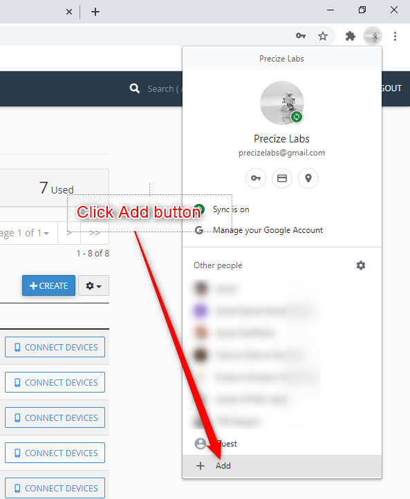
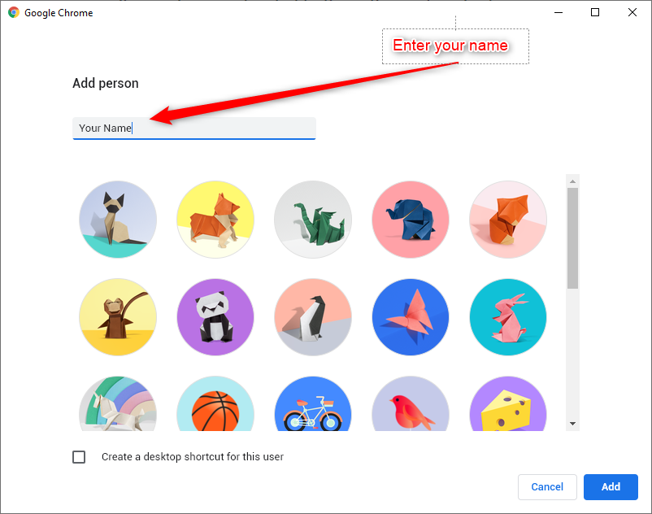
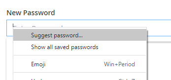

# Creating new Google Business Account    
 - Open Google Chrome 
 - Click the user list icon at top right 
 - From there, click the Add button 
 -   
 - In the next window enter your name
 - 
 - Then navigate to this address to create new account `https://accounts.google.com/signup`
 - Click `Use my current email address instead` to use company email address 
 - 
 - then continue the steps and create account 
 - Provide your phone number also 
 - Don't forget to turn on sync 
 - When ever you need new password, please use google password generator as below 
 - 